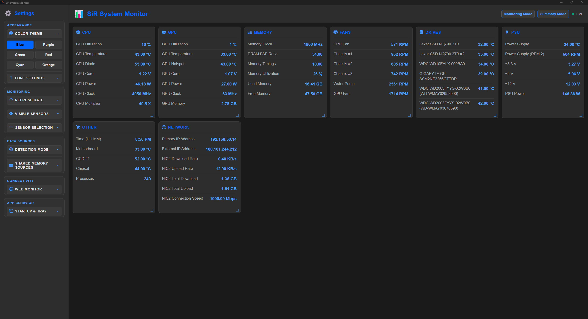
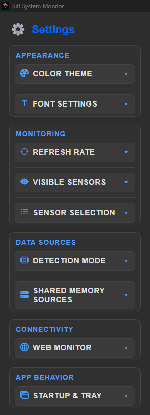
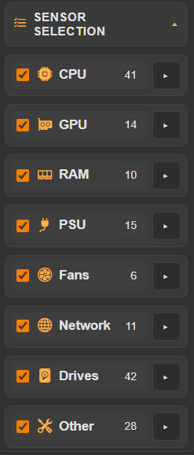
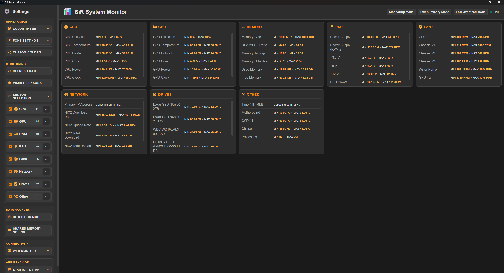
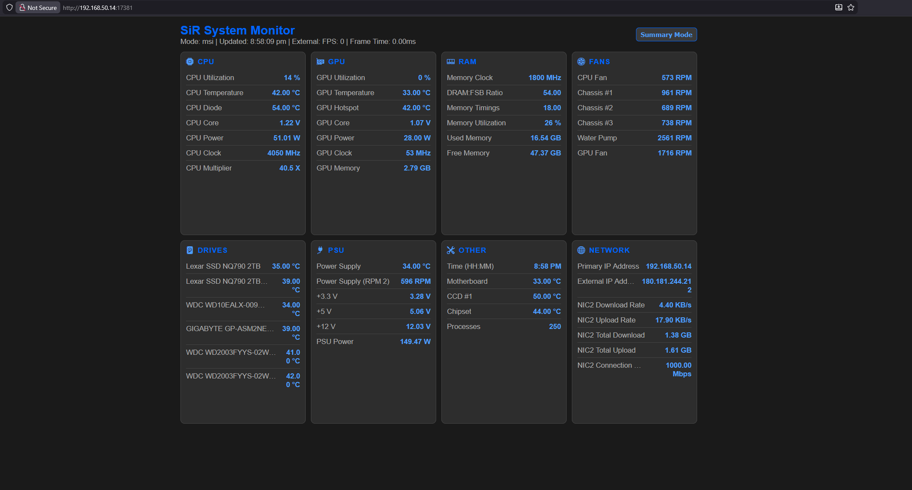
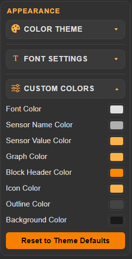
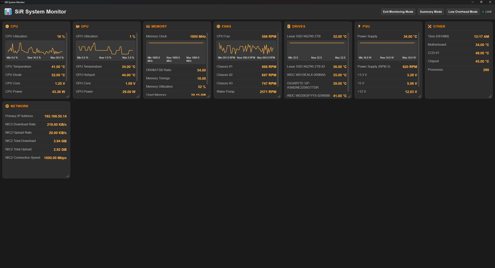
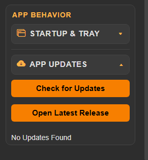

# SiR System Monitor

SiR System Monitor is a Windows Electron desktop app for real-time hardware telemetry with optional browser viewing.

It reads shared-memory data from RTSS/AIDA64/HWiNFO/LHM (when available), provides grouped live cards, sensor selection, summary and low-overhead modes, web monitor output, color customization, and packaged installer/portable builds.

## Table of Contents

- [What It Does](#what-it-does)
- [Screenshots](#screenshots)
- [Requirements](#requirements)
- [Settings Overview](#settings-overview)
- [Sensor Sources](#sensor-sources)
- [Web Monitor](#web-monitor)
- [Troubleshooting](#troubleshooting)

## What It Does

- Displays live hardware sensors grouped by:
  - CPU
  - GPU
  - RAM
  - PSU
  - Fans
  - Network
  - Drives
  - Other
- Supports configurable refresh rate and sensor visibility.
- Supports per-sensor selection and ordering.
- Supports Monitoring Mode, Summary Mode, and Low Overhead Mode.
- Supports summary mode (min/max session view) with browser summary lockout while Low Overhead Mode is enabled.
- Supports live color customization for:
  - UI font color
  - Sensor name color
  - Sensor value color
  - Icon color
  - Graph color
  - Sensor block header color
  - Outline color
  - Background color
- Supports resetting colors back to defaults for the currently selected theme.
- Exposes a browser-accessible monitor page and JSON endpoint.
- Builds as:
  - NSIS installer
  - Portable EXE

## Screenshots

1. Main dashboard

2. Grouped settings sidebar

3. Sensor selection and ordering

4. Summary mode

5. Web monitor page

6. Color Options

7. Graphs

8. Updater

## Requirements

- OS: Windows

Optional (for richer sensors):

- RTSS / MSI Afterburner
- AIDA64 with Shared Memory enabled
- HWiNFO / LHM shared memory providers

## Settings Overview

Settings are grouped in the sidebar:

- Appearance
  - Color theme
  - Font size/family and text options
  - Custom colors (font, sensor names, sensor values, icon, graph, sensor block headers, outline, background)
  - Reset to theme defaults
- Monitoring
  - Monitoring Mode toggle
  - Summary Mode toggle
  - Low Overhead Mode toggle
  - Refresh rate (1000–5000 ms)
  - Visible sensor groups
  - Sensor Selection panel
- Data Sources
  - Detection mode
  - Shared memory provider toggles
- Connectivity
  - Web monitor enable, host/port, open URL
- App Behavior
  - Launch at startup
  - Start minimized
  - Minimize/close to tray

All settings are persisted locally.

## Sensor Sources

Primary runtime path uses shared memory integration:

- RTSS
- AIDA64
- HWiNFO
- LHM

## Web Monitor

When enabled:
- UI endpoint: `http://<host>:<port>/`
- JSON endpoint: `http://<host>:<port>/api/monitor`
Useful for viewing selected sensors from another device on LAN or WAN, subject to local firewall/network rules.

## Updater

SiR System Monitor uses `electron-updater` with GitHub Releases as the update source.

Current behavior is manual (user-driven):

- In Settings → App Behavior → App Updates, click **Check for Updates**.
- If no update exists, status shows: **No Updates Found**.
- If an update exists, an in-app modal appears and lets the user choose **Download Update**.
- After download completes, the app shows **Restart and Install**.
- If updater metadata is missing on the release, the app falls back to **Open Latest Release**.

### How it roughly works

- Main process (`main.js`) performs update check/download/install and emits status events.
- Renderer (`app.js`) listens to updater status events and updates the settings status + modal UI.
- The release URL button opens the project’s latest GitHub releases page.

## Troubleshooting

1. Missing sensors

- Ensure provider app is running (AIDA64/HWiNFO/RTSS as needed).
- Check provider toggles in Settings → Data Sources.

2. Browser monitor not reachable

- Verify host/port in Settings → Connectivity.
- If using other devices, use host `0.0.0.0` and allow firewall access.

3. Performance / latency concerns

- Keep refresh rate at 1000ms or higher.
- Close unnecessary overlays/providers not in use.
