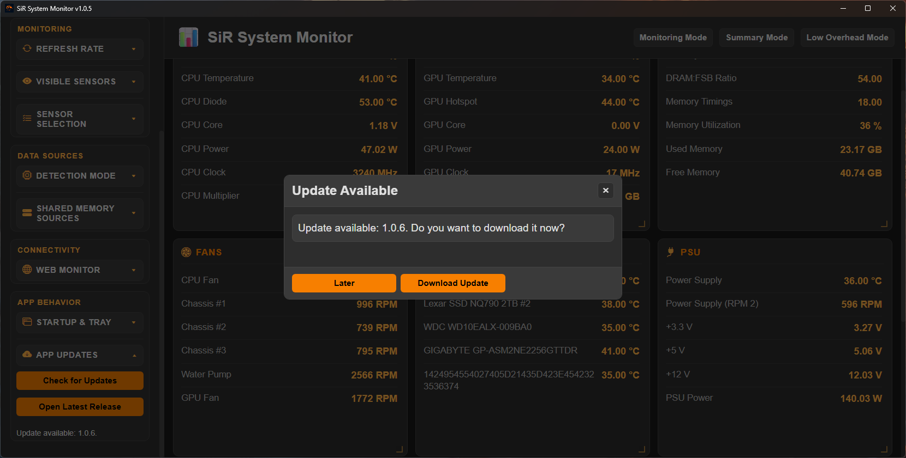
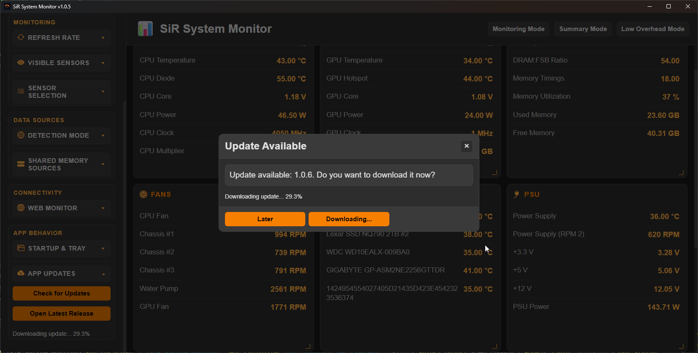

# SiR System Monitor

SiR System Monitor is a Windows Electron desktop app for real-time hardware telemetry with optional browser viewing.

It reads shared-memory data from RTSS/AIDA64/HWiNFO/LHM (when available), provides grouped live cards, sensor selection controls, summary and low-overhead modes, web monitor output, appearance customization, and packaged installer/portable builds.

## Table of Contents

- [What It Does](#what-it-does)
- [Screenshots](#screenshots) - May be a little outdated.
- [Requirements](#requirements)
- [Settings Overview](#settings-overview)
- [Backup & Restore](#backup--restore---export--import)
- [Sensor Sources](#sensor-sources)
- [Sensor Naming & Grouping Notes](#sensor-naming--grouping-notes)
- [Web Monitor](#web-monitor)
- [Updater](#updater)
- [Troubleshooting](#troubleshooting)

## What It Does

- Displays live hardware sensors grouped by:
  - CPU
  - GPU
  - RAM
  - PSU
  - Fans
  - Network
  - Drives
  - Other
- Supports configurable refresh rate and sensor visibility.
- Supports per-sensor selection and drag-and-drop ordering.
- Supports custom sensor names in Sensor Selection with inline rename editing (`✎`).
- Supports resetting all custom sensor names.
- Supports Monitoring Mode and Summary Mode.
- Supports summary mode (session min/max view).
- Supports appearance customization:
  - Theme presets
  - Style presets (Classic, Neon, Minimal, Glass, Terminal)
  - Font size/family, bold text, monospace values
  - Temperature unit toggle (Celsius/Fahrenheit)
  - Custom colors for UI channels (font, sensor label/value, icon, graph, block header, outline, background)
- Supports resetting colors back to defaults for the currently selected theme.
- Exposes a browser-accessible monitor page and JSON endpoint.

## Requirements

- OS: Windows 10+ (Might work on earlier versions but I have not personally tested.)

## At least one of these is required to show ANY sensors:

- RTSS / MSI Afterburner (Only for FPS/Frame Times)
- AIDA64 with Shared Memory enabled
- HWiNFO / LHM shared memory providers

## Settings Overview

Settings are grouped in the sidebar:

## Settings Overview

Settings are grouped in the sidebar:

- Appearance
  - Color theme
  - Style preset
  - Font size/family and text options
  - Temperature unit selector (°C / °F)
  - Custom colors (font, sensor names, sensor values, icon, graph, sensor block headers, outline, background)
  - Reset to theme defaults
- Monitoring
  - Summary Mode toggle
  - Settings gear button (opens the Settings sidebar)
  - Refresh rate (1000–5000 ms)
  - Visible sensor groups
  - Sensor Selection panel
    - per-sensor enabled state
    - drag-and-drop ordering
    - inline rename button per sensor row
    - reset custom sensor names button
- Data Sources
  - Detection mode
  - Shared memory provider toggles
- Connectivity
  - Web monitor enable, host/port, open URL
  - Discord Rich Presence (enable / disable)
- App Behavior
  - Launch at startup
  - Start minimized
  - Minimize/close to tray
  - App update controls

All settings are persisted locally.

### Backup & Restore / Export & Import

SiR System Monitor provides an in-app Export and Import flow to back up your current settings or restore them from a JSON file.

- Export: produces a JSON file containing your active settings including theme, style preset, temperature unit, custom colors, appearance options, sensor selection and ordering, connectivity settings (web monitor host/port), and updater preferences.
- Import: opens a preview modal showing which settings will change (theme and color previews are applied in the preview). You can choose **Apply Now** to apply settings immediately without a full reload, or **Apply & Reload** to apply settings and restart the renderer to ensure all subsystems pick up the new state.

Usage:

1. Open Settings → Backup & Restore.
2. Click **Export** to save a JSON snapshot of the current settings.
3. Click **Import** and select a previously exported JSON file to preview its values.
4. Use **Apply Now** to apply the visible changes instantly, or **Apply & Reload** to apply and restart the UI for a fuller effect.

Notes:

- Exported files are portable between installs of the same app version family; major version upgrades may change settings semantics.

### Discord Rich Presence

- Presence is enabled by default.
- To disable Rich Presence: open Settings → Connectivity → Discord Rich Presence → select **Disabled**. The app will stop sending presence updates immediately.

## Sensor Sources

Primary runtime path uses shared-memory integration:

- RTSS
- AIDA64
- HWiNFO
- LHM

## Sensor Naming & Grouping Notes

- The app applies display-label normalization for common provider naming quirks.
- Custom names (from Sensor Selection rename) override normalized labels.

## Web Monitor

When enabled:

- UI endpoint: `http://<host>:<port>/`
- JSON endpoint: `http://<host>:<port>/api/monitor`
- When the web monitor is active the header shows a small status indicator marked **Sharing** to indicate the app is publishing the browser-accessible view.

Useful for viewing selected sensors from another device on LAN or WAN, subject to local firewall/network rules.

> Use on WAN at your own risk.

## Updater

SiR System Monitor uses `electron-updater` with GitHub Releases as the update source.

Current behavior is manual (user-driven):

- In Settings → App Behavior → App Updates, click **Check for Updates**.
- If no update exists, status shows: **No Updates Found**.
- If an update exists, an in-app modal appears and lets the user choose **Download Update**.
- After download completes, the app shows **Restart and Install**.
- If updater metadata is missing on the release, the app falls back to **Open Latest Release**.

## Troubleshooting

1. Missing sensors

- Ensure provider app is running (AIDA64/HWiNFO/RTSS as needed).
- Check provider toggles in Settings → Data Sources.

2. Browser monitor not reachable

- Verify host/port in Settings → Connectivity.
- If using other devices, use host `0.0.0.0` and allow firewall access.

3. Performance / latency concerns

- Keep refresh rate at 1000ms or higher.
- Close unnecessary overlays/providers not in use.

## Screenshots

1. Main dashboard

2. Grouped settings sidebar

3. Sensor selection and ordering

4. Summary mode

5. Web monitor page

6. Color options

7. Graphs

8. Updater

