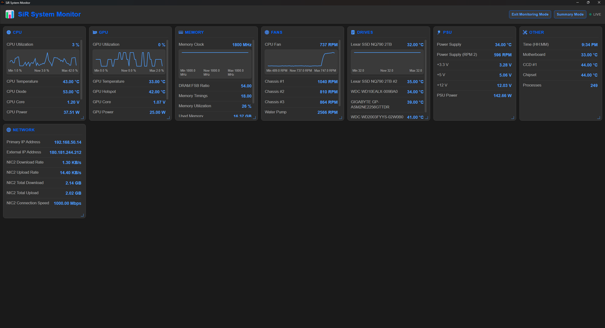

# SiR System Monitor

SiR System Monitor is a Windows Electron desktop app for real-time hardware telemetry with optional browser viewing.

It reads shared-memory data from RTSS/AIDA64/HWiNFO/LHM (when available), provides grouped live cards, sensor selection, summary/monitoring modes, low-overhead mode, web monitor output, and packaged installer/portable builds.

## Table of Contents

- [What It Does](#what-it-does)
- [Screenshots](#screenshots)
- [Requirements](#requirements)
- [Settings Overview](#settings-overview)
- [Sensor Sources](#sensor-sources)
- [Web Monitor](#web-monitor)
- [Troubleshooting](#troubleshooting)
- [Known Issues](#KnownIssues)

## What It Does

- Displays live hardware sensors grouped by:
  - CPU
  - GPU
  - RAM
  - PSU
  - Fans
  - Network
  - Drives
  - Other
- Supports configurable refresh rate and sensor visibility.
- Supports per-sensor selection and ordering.
- Supports interactive per-sensor graphs (expand/collapse each sensor row).
- Supports Monitoring Mode for a cleaner full-focus dashboard view.
- Supports Summary Mode (min/max session view).
- Keeps Summary stats populated in the background (even when Summary Mode is not currently active).
- Supports Low Overhead Mode:
  - Forces Monitoring Mode on while enabled.
  - Disables Summary stat population while enabled.
  - Hides Summary toggle while enabled.
- Supports draggable and resizable sensor group windows/cards in desktop view.
- Syncs selected sensor data, graph state/history, group order, and group layout to the browser monitor.
- Adds helpful hover tooltips across settings and action buttons.
- Exposes a browser-accessible monitor page and JSON endpoint.
- Builds as:
  - NSIS installer
  - Portable EXE

## Screenshots
1. Main dashboard

2. Grouped settings sidebar

3. Sensor selection and ordering

4. Summary mode

5. Web monitor page

6. On Demand Graphs

## Requirements
- OS: Windows 10 or above.

Optional (for richer sensors):

- RTSS / MSI Afterburner
- AIDA64 with Shared Memory enabled
- HWiNFO / LHM shared memory providers

## Settings Overview
Settings are grouped in the sidebar:

- Appearance
  - Color theme
  - Font size/family and text options
- Monitoring
  - Monitoring Mode toggle (focus view)
  - Summary Mode toggle (min/max view)
  - Low Overhead Mode toggle (reduced overhead profile)
  - Refresh rate (1000–5000 ms)
  - Visible sensor groups
  - Sensor Selection panel
  - Expandable live graphs per sensor
  - Drag/reorder and resize sensor group windows
- Data Sources
  - Detection mode
  - Shared memory provider toggles
- Connectivity
  - Web monitor enable, host/port, open URL
- App Behavior
  - Launch at startup
  - Start minimized
  - Minimize/close to tray
All settings are persisted locally.

## Sensor Sources
Primary runtime path uses shared memory integration:

- RTSS
- AIDA64
- HWiNFO
- LHM

## Web Monitor
When enabled:

- UI endpoint: `http://<host>:<port>/`
- JSON endpoint: `http://<host>:<port>/api/monitor`

The browser view mirrors desktop monitor state, including:

- Sensor values and formatting
- Expanded graph state and recent graph history
- Group order
- Group layout (saved height/span per group)
- Theme/font visual settings

Browser behavior notes:

- Header now shows a friendly mode label (`Shared Memory`) and last update time.
- Zero-value external text such as `FPS: 0 | Frame Time: 0.00ms` is suppressed.
- When Low Overhead Mode is enabled on desktop, browser Summary Mode is locked off and its toggle is hidden.

Useful for viewing selected sensors from another device on LAN (use host `0.0.0.0`), subject to local firewall/network rules.

## Troubleshooting

1. Missing sensors

- Ensure provider app is running (AIDA64/HWiNFO/RTSS as needed).
- Check provider toggles in Settings → Data Sources.

2. Browser monitor not reachable

- Verify host/port in Settings → Connectivity.
- If using other devices, use host `0.0.0.0` and allow firewall access.

3. Performance / latency concerns

- Keep refresh rate at 1000ms or higher.
- Close unnecessary overlays/providers not in use.

## KnownIssues
1. Some sensors may report inconsistent units depending on provider and hardware model.
2. Some sensors may be unavailable depending on AIDA64/HWiNFO/RTSS export configuration.
