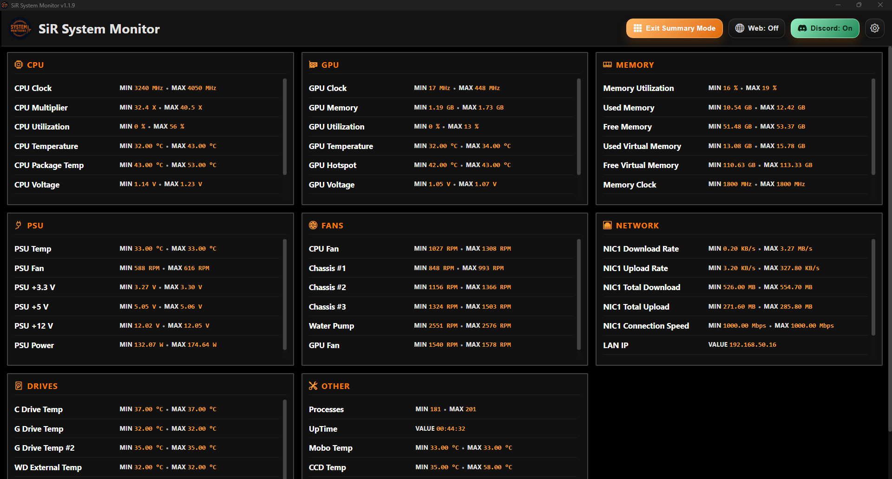
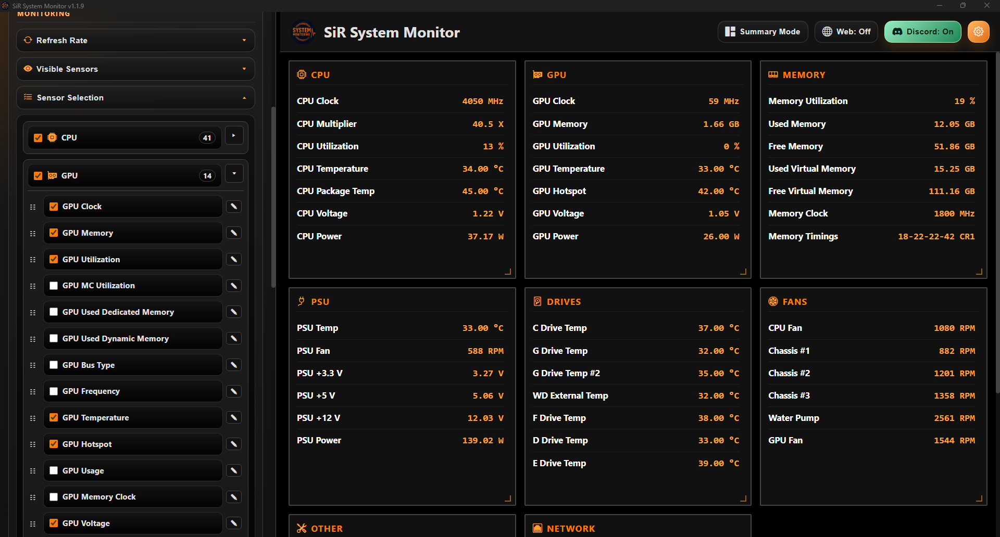
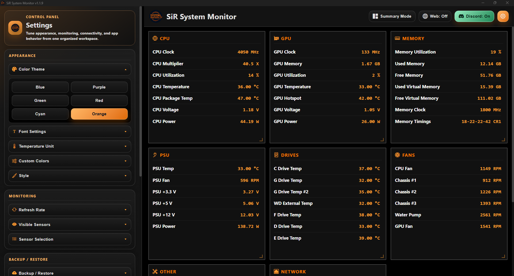
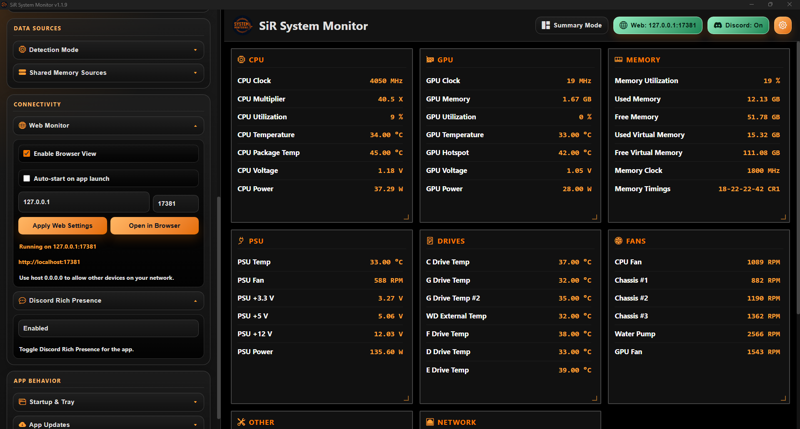

<div align="center">
  <h1>SiR System Monitor</h1>
  <p><strong>Real-time hardware monitoring for Windows, your desktop, your overlay, and your browser.</strong></p>
  <p>
    <a href="https://github.com/KaMiKaZeE1221/SiR-System-Monitor/releases/latest"></a>
    <a href="#requirements"></a>
    <a href="./LICENSE.txt"></a>
  </p>
  <p>
    <a href="https://github.com/KaMiKaZeE1221/SiR-System-Monitor/releases/latest">Download</a> ·
    <a href="./CHANGELOG.md">What's new</a> ·
    <a href="./sensor-host/HARDWARE-SUPPORT.md">Hardware support</a> ·
    <a href="./TERMS_OF_SERVICE.md">Terms</a> ·
    <a href="./PRIVACY_POLICY.md">Privacy</a> ·
    <a href="#screenshots">Screenshots</a>
  </p>
</div>


SiR System Monitor is an open-source Windows desktop app that combines live system telemetry, a configurable sensor dashboard, an on-screen display, alerts, and an optional browser monitor. Its bundled collector handles everyday monitoring without requiring another hardware-monitoring app to remain open.

## At a glance

| | |
|---|---|
| **Built-in monitoring** | CPU, memory, storage, network, latency, system information, and supported digital PSUs without a separate monitoring app. |
| **Enhanced hardware access** | A bundled LibreHardwareMonitor backend adds supported temperatures, clocks, power, voltage, fans, SMART data, GPUs, and controllers. |
| **A dashboard that fits you** | Choose which sensors appear, search, rename, reorder, resize, group, and include them in the overlay. |
| **Desktop and web layouts** | Give normal and Summary modes their own Compact, Balanced, Wide, Stacked, or freely resized Custom layout in both the app and Web Monitor. |
| **Overlay and alerts** | Keep selected readings over other apps and highlight warning or critical threshold events. |
| **App telemetry** | Monitor SiR's own CPU/RAM use, uptime, process/window counts, refresh timing, sensor counts, active alerts, and Web Monitor connections. |
| **Built-in diagnostics** | Run support-oriented checks, copy a combined report, or create a privacy-scrubbed ZIP support bundle directly from the app. |
| **Configurable motion** | Independently control settings, dialog, Summary transition, and sensor-card icon animations, with matching Web Monitor behavior. |
| **Profiles and portability** | Save named profiles or export the complete setup to JSON for backup and transfer. |

Sensor groups include **FPS, CPU, GPU, Memory, PSU, Fans, Network, Ping, Drives, App, and Other**. FPS and frame-time values appear when an enabled source provides them.

## What's new in 1.3.5

- Added **Light**, **Dark**, and **Follow Windows** appearance modes, with independent custom-color palettes saved for Light and Dark.
- Expanded Summary Mode with running **Minimum**, **Average**, and **Maximum** values plus **Reset Stats** in both the desktop app and Web Monitor.
- Made mouse-wheel and trackpad scrolling work across the full card surface when the desktop dashboard uses Stacked layout.
- Replaced native card dragging with visual-grid placement, a precise drop marker, reliable edge scrolling, and predictable ordering in mixed-size Custom layouts.
- Fixed the active **Exit Summary Mode** button contrast on bright accent themes.
- Refined Discord Rich Presence so it reports a stable app session without invented player counts or placeholder game activity.
- Added application and Discord integration [Terms of Service](./TERMS_OF_SERVICE.md) and [Privacy Policy](./PRIVACY_POLICY.md).

See the [full changelog](./CHANGELOG.md) for every change and fix.

## Download

Get the latest Windows installer or portable build from [GitHub Releases](https://github.com/KaMiKaZeE1221/SiR-System-Monitor/releases/latest).

| Build | Best for |
|---|---|
| **Setup** | A normal installation with Start menu, desktop shortcut, launch options, and automatic-update support. |
| **Portable** | Running without a full installation or keeping a self-contained copy. |

### Requirements

- Windows 10 or Windows 11, 64-bit
- Administrator access only when **Enhanced Hardware Sensors**, its bundled low-level hardware-access driver, or **Launch app as administrator** is enabled
- Network access only for update checks, WAN IP lookup, Discord Rich Presence, or clients using the Web Monitor

> [!NOTE]
> Built-in Sensors require no separate monitoring software. Enhanced Hardware Sensors and the PawnIO driver used for protected low-level access are bundled with SiR System Monitor; Windows may request administrator access to install the driver and read supported hardware.

## Quick start

1. Install SiR System Monitor or launch the portable build.
2. Leave **Settings → Monitoring → Sensor Sources → Built-in Sensors** enabled.
3. Open **Monitoring → Visible Sensors** and **Sensor Selection** to choose and arrange the readings you want.
4. Choose separate normal and Summary card presets under **Appearance → Layout**, or select **Custom** for either mode to resize its cards independently.
5. Fine-tune interface motion under **Appearance → Animations**, including the effects mirrored to the Web Monitor.
6. Enable **Enhanced Hardware Sensors** only if you want the additional readings supported by your hardware.
7. Optionally configure the overlay, alerts, Web Monitor, startup behavior, and a settings profile. Use **Diagnostics → Create Support Bundle** when preparing a privacy-scrubbed support archive.

## Sensor sources

SiR uses an isolated, persistent collector so standard sensor refreshes do not repeatedly launch PowerShell or another full monitoring application.

| Source | External app required? | Typical use |
|---|:---:|---|
| **Built-in Sensors** | No | CPU utilization and overall clock, vendor-neutral FPS/frame time, memory capacity and activity, storage, network, latency, system data, and supported direct digital PSU telemetry. |
| **Enhanced Hardware Sensors** | No | Supported CPU/GPU temperatures and clocks, power, voltage, fans, motherboard controllers, storage SMART data, and additional hardware telemetry. Administrator access may be required. |
| **App telemetry** | No | SiR private working-set memory (comparable to Task Manager), optional private commit and full working set, CPU, uptime, windows/processes, refresh performance, sensor/alert counts, and Web Monitor connections. Uses the existing refresh cycle and does not start another collector. |
| **RTSS / MSI** | Yes, optional | Additional FPS, frame-time, and compatible shared-memory telemetry. |
| **AIDA64** | Yes, optional | Extra sensors exposed through AIDA64 shared memory. |
| **HWiNFO / LHM Shared Memory** | Yes, optional | Compatibility access to sensors published by HWiNFO or a running LHM shared-memory provider. |

Only enable compatibility providers you use. This keeps the sensor catalogue cleaner and avoids duplicate readings from overlapping sources.

Native FPS and frame time use the signed PresentMon component bundled inside the sensor host. It reads Windows presentation events across AMD, NVIDIA, and Intel GPUs without installing a separate application or service. SiR follows the foreground rendering process, retains the last active game while you view the dashboard, and disables unused GPU-duration, input, and display-duration tracing to keep overhead low.

### Enhanced Hardware Sensors

Enabling Enhanced Hardware Sensors displays a themed confirmation before SiR:

1. Saves the enhanced-sensor setting.
2. Enables **Startup & Tray → Launch app as administrator**.
3. Restarts and asks Windows for administrator access.
4. Installs or updates the bundled PawnIO driver when required for Intel CPU package power and other protected readings.

Availability still depends on the hardware, firmware, driver, Windows permissions, and whether another application has exclusive access to the device.

## Diagnostics and support reports

Open **Diagnostics** from the dashboard's top row. The page contains six allowlisted, read-only support checks:

- **System & App Report** — version, Windows, processor, memory, displays, GPU, permissions, and Electron processes
- **Quick Sensor Check** — built-in sensor groups, startup time, FPS support, PSU coverage, and collector memory
- **Enhanced Hardware Check** — enhanced processor, GPU, motherboard/controller, and peripheral discovery
- **Sensor Startup Timing** — progressive sensor availability during a fresh 12-second discovery window
- **Collector Recovery Check** — confirms a dedicated test collector restarts without losing its catalogue
- **Sensor Performance Benchmark** — an eight-second collector CPU, memory, and request-latency sample

Only one check runs at a time. Longer checks can be cancelled, and every result is appended to one resizable text box that can be copied into a bug report. Diagnostic execution is restricted to fixed bundled scripts and arguments; the page cannot run arbitrary commands.

**Create Support Bundle** first shows a theme-aware warning, then clears the results box and runs all six checks sequentially. Passes, failures, and timeouts are all retained in the report; an explicit cancellation stops the suite and does not create a ZIP. After all checks finish, the app asks where to save a privacy-scrubbed bundle containing the diagnostic results, a fresh system report, settings, sensor catalogue, and runtime state.

## Dashboard and appearance

### Sensor controls

Each sensor can be:

- Enabled or hidden
- Included in or excluded from the overlay
- Reordered with drag and drop
- Renamed inline and reset to its original name
- Found quickly with Sensor Selection search
- Used by an alert rule when the sensor is enabled

### Layouts

Normal mode and Summary Mode each have an independent layout. The desktop dashboard and Web Monitor use the matching choice for the mode currently being viewed.

| Layout | Purpose |
|---|---|
| **Compact** | Fits more cards and data into a smaller area. |
| **Balanced** | A general-purpose balance of density and readability. |
| **Wide** | Gives long sensor names and values more horizontal space. |
| **Stacked** | Uses a more vertical card arrangement. |
| **Custom** | Unlocks independent width and height resizing for each card. |

Normal and Summary geometry and card order are stored separately, so resizing or moving a Summary card never changes the normal dashboard. Both arrangements and the mode preference are included in profiles and exported settings.

### Themes and styles

- Light, Dark, or Follow Windows appearance, with a separate customizable palette retained for each light/dark mode
- Multiple accent themes plus independent settings-panel background, accent, and icon colors
- `Classic`, `Neon`, `Minimal`, `Terminal`, `Accent Rail`, `Soft Glass`, `Split Header`, and `Status Tags` styles
- Font family, size, bold text, and monospace value controls
- Celsius or Fahrenheit temperature display
- Optional glow-effect disable switch
- Optional settings-animation disable switch

## On-screen overlay

The overlay shows selected readings above other applications and can be toggled from the header or a global hotkey.

- Position and monitor selection
- Font size, scaling, spacing, and opacity
- Configurable category order and per-category line limits
- Single-line grouped layouts that size themselves to fit their contents
- Theme-aware warning and critical alert highlighting

## Web Monitor and API

The optional Web Monitor mirrors the selected dashboard layout in a browser and exposes the same live data as JSON.

| Endpoint | Address |
|---|---|
| Dashboard | `http://<host>:<port>/` |
| JSON API | `http://<host>:<port>/api/monitor` |
| Reset Summary session | `POST http://<host>:<port>/api/session/reset` |

Available controls include:

- Local-only or all-interface binding
- Optional access-token authentication
- Token generation, copying, and rotation
- API-only mode, which disables the HTML dashboard
- Alert highlighting, light/dark appearance, session statistics, and independent normal/Summary layouts mirrored from the desktop app

Access tokens are accepted through:

- Query string: `?token=...`
- Header: `x-sir-token: ...`
- Header: `Authorization: Bearer <token>`

Use `127.0.0.1` for access from the same PC. Use `0.0.0.0` only when another trusted device on the network must connect, then restrict access with the Windows Firewall and an access token.

> [!WARNING]
> Binding to `0.0.0.0` listens on every available network interface. Do not expose the Web Monitor directly to the public internet.

## Alerts, profiles, and saved settings

Sensor Alerts support `>=`, `>`, `<=`, and `<` conditions, configurable cooldowns, and Warning or Critical severity. Triggered sensors are highlighted in the desktop dashboard, overlay, and Web Monitor.

Under **Settings → Backup & Restore**, you can:

- Save, apply, rename, and delete named profiles
- Export the current setup to JSON
- Preview an imported profile before applying it
- Apply immediately or apply and reload

Profiles and exports include the Light/Dark/Follow Windows preference, both custom appearance palettes, settings motion preferences, all settings-panel colors, separate normal/Summary layouts, Custom card sizes and card order, sensor choices, alert rules, data sources, Web Monitor options, overlay configuration, startup behavior, and update preferences.

## Digital PSU support

The bundled collector includes read-only telemetry for supported USB digital power supplies. It never changes fan curves, rail configuration, over-current protection, or other PSU settings.

| Family | Supported models / IDs |
|---|---|
| **Thermaltake DPS / iRGB** | USB ID `264A:2329`; the model is queried from the device. |
| **Corsair HXi / RMi** | 15 protocol-compatible IDs covering HX550i through current HX1200i/HX1500i generations and RM550i through RM1000i. |
| **NZXT E-series** | E500, E650, and E850 PMBus-over-HID devices. |

See [Native hardware sensor coverage](./sensor-host/HARDWARE-SUPPORT.md) for the complete USB ID registry, intentionally excluded devices, enhanced controller families, and protocol references.

## Updates

Open **Settings → App Behavior → App Updates** to:

1. Check for updates.
2. Download an available update.
3. Restart to install it.

Automatic startup checks can be disabled. If a release does not include the metadata needed for an in-app download, **Open Latest Release** provides a browser fallback.

## Troubleshooting

<details>
<summary><strong>Sensors are missing or still detecting</strong></summary>

- Confirm **Built-in Sensors** is enabled.
- Give enhanced hardware discovery a moment to complete after a cold start; groups are published progressively.
- Try **Enhanced Hardware Sensors** for compatible temperature, fan, clock, voltage, power, GPU, SMART, and controller readings.
- If using RTSS, AIDA64, HWiNFO, or LHM shared memory, make sure that provider is running and its shared-memory output is enabled.
- Another vendor utility may have exclusive access to a USB controller or PSU.
- Check the [hardware support reference](./sensor-host/HARDWARE-SUPPORT.md) for direct PSU and enhanced-controller coverage.

</details>

<details>
<summary><strong>FPS or Frame Time is not updating</strong></summary>

- FPS data appears only when an enabled source exposes it for the running application.
- For RTSS compatibility, start RTSS/MSI Afterburner, enable the RTSS provider in SiR, and confirm RTSS is detecting the target application.
- Check whether another overlay or capture tool is interfering with the same game or OSD source.

</details>

<details>
<summary><strong>The Web Monitor cannot be reached</strong></summary>

- Test `127.0.0.1` from the host PC first.
- Verify the configured host and port under **Settings → Connectivity**.
- For another device on the LAN, bind to `0.0.0.0` and allow the selected port through Windows Firewall.
- Include the correct token when authentication is enabled.

</details>

<details>
<summary><strong>Performance is heavier than expected</strong></summary>

- Keep the refresh interval at `1000 ms` or higher.
- Disable compatibility providers you are not actively using.
- Reduce visible sensor groups or overlay entries if rendering is the bottleneck.
- Use Built-in Sensors alone when low-level enhanced telemetry is not needed.

</details>

## Screenshots

<table>
    <td width="50%"><br><sub><strong>Summary Mode</strong> — live minimum and maximum values</sub></td>
    <td width="50%"><br><sub><strong>Sensor Selection</strong> — choose, rename, and arrange readings</sub></td>
  </tr>
  <tr>
    <td width="50%"><br><sub><strong>Appearance</strong> — themes, styles, fonts, layouts, and colors</sub></td>
    <td width="50%"><br><sub><strong>Web Monitor</strong> — browser access, API, and security controls</sub></td>
  </tr>
</table>

<details>
<summary><strong>View more color themes</strong></summary>

<table>
  <tr>
    <td width="50%"></td>
    <td width="50%"></td>
  </tr>
  <tr>
    <td width="50%"></td>
    <td width="50%"></td>
  </tr>
  <tr>
    <td colspan="2"></td>
  </tr>
</table>

</details>

More screenshots are available in the [Imgur album](https://imgur.com/a/pkG1Cyb).

## Build from source

### Prerequisites

- Windows 10 or 11, 64-bit
- A current Node.js LTS release and npm
- Windows PowerShell
- The 64-bit .NET Framework C# compiler at `C:\Windows\Microsoft.NET\Framework64\v4.0.30319\csc.exe`
- Internet access on the first sensor-host build to download the pinned LibreHardwareMonitor 0.9.6 archive

### Run locally

```powershell
git clone https://github.com/KaMiKaZeE1221/SiR-System-Monitor.git
Set-Location SiR-System-Monitor
npm ci
npm start
```

`npm start` builds the bundled sensor host before launching Electron.

### Useful commands

| Command | Purpose |
|---|---|
| `npm start` | Build the sensor host and run the app. |
| `npm run test:sensors` | Build and run the hardware catalogue and sensor-host integration tests. |
| `npm run test:sensors:enhanced` | Exercise the enhanced sensor path. |
| `npm run test:sensors:startup` | Measure staged sensor startup behavior. |
| `npm run test:layout` | Verify desktop and Web Monitor layout presets. |
| `npm run test:diagnostics-ui` | Verify the end-user diagnostics allowlist, runner, and UI. |
| `npm run test:version` | Verify version consistency across release files. |
| `npm run dist:win` | Build the Windows installer and portable package. |

### Project map

```text
main.js           Electron main process, windows, tray, updates, and web server
app.js            Dashboard behavior, settings, profiles, and sensor rendering
diagnosticsCatalog.js  Allowlisted end-user diagnostic checks and fixed arguments
sensorReader.js   Built-in collector and optional provider aggregation
rtssReader.js     RTSS, AIDA64, HWiNFO, and LHM shared-memory compatibility
sensor-host/      Bundled native sensor collector source and hardware registry
overlay.*         On-screen overlay window, behavior, and styling
scripts/          Build, test, benchmark, and release helpers
Screenshots/      README and project screenshots
```

## License

SiR System Monitor is licensed under the [GNU General Public License v3.0](./LICENSE.txt). Third-party components remain subject to their own licenses and notices.

The official desktop application, Web Monitor, and Discord Rich Presence integration are also described by the [Terms of Service](./TERMS_OF_SERVICE.md) and [Privacy Policy](./PRIVACY_POLICY.md).

---

<div align="center">
  Built by <strong>SiR_KaMiKaZeE</strong> · <a href="https://github.com/KaMiKaZeE1221/SiR-System-Monitor/releases/latest">Latest release</a> · <a href="./CHANGELOG.md">Changelog</a> · <a href="./TERMS_OF_SERVICE.md">Terms</a> · <a href="./PRIVACY_POLICY.md">Privacy</a>
</div>
