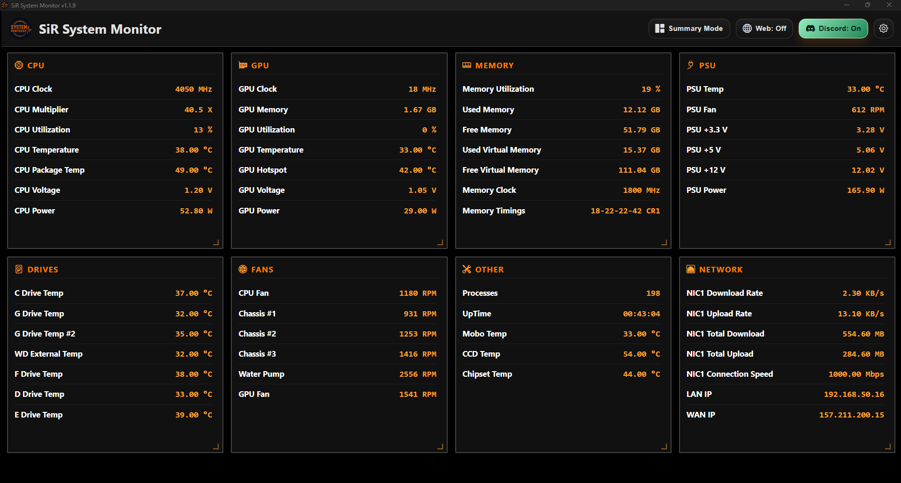
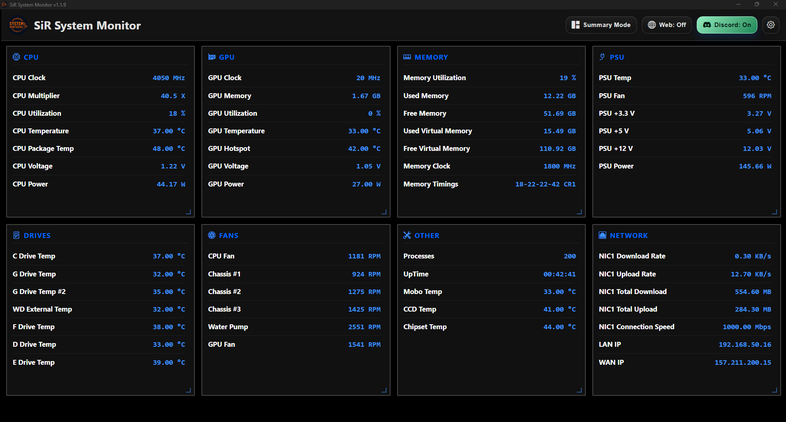
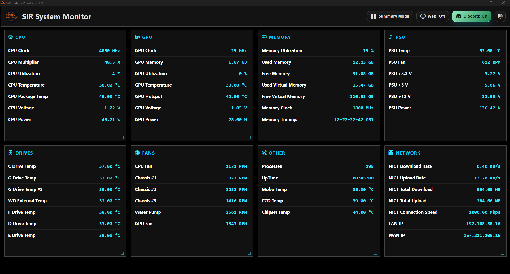
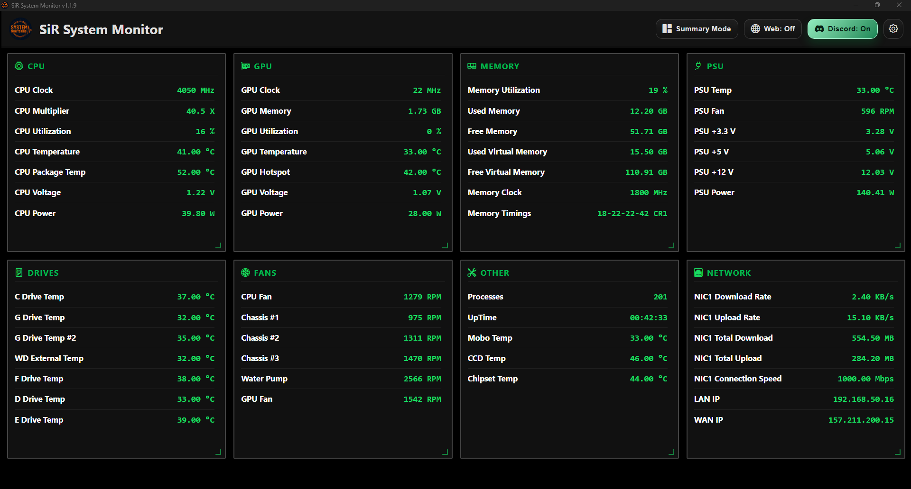
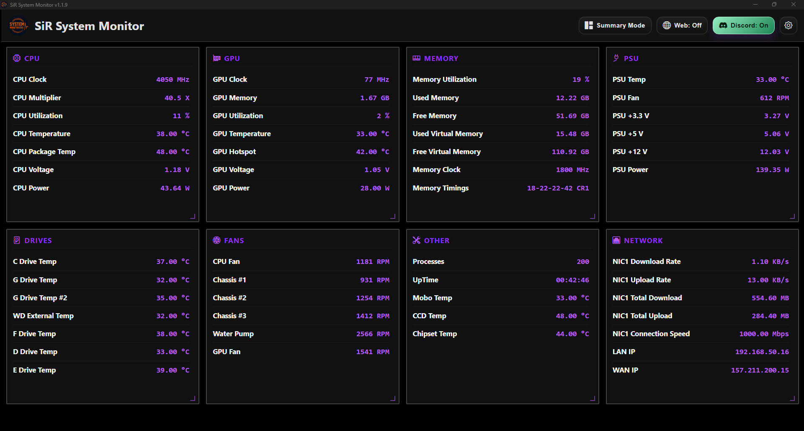
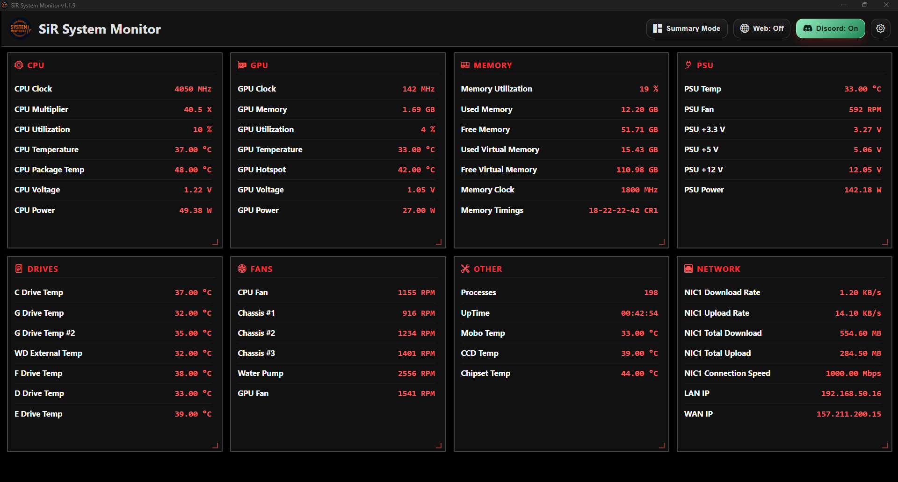

# SiR System Monitor

A Windows Electron desktop app for real-time hardware telemetry, overlay display, and optional browser-based monitoring.

## :books: Contents
- [Overview](#computer-overview)
- [Core Features](#sparkles-core-features)
- [Requirements](#white_check_mark-requirements)
- [Settings Overview](#gear-settings-overview)
- [Backup and Restore](#floppy_disk-backup-and-restore)
- [Data Sources](#test_tube-data-sources)
- [Overlay Notes](#window-overlay-notes)
- [Web Monitor](#globe_with_meridians-web-monitor)
- [Updater](#arrows_counterclockwise-updater)
- [Troubleshooting](#rescue_worker_helmet-troubleshooting)
- [Screenshots](#framed_picture-screenshots)

## :computer: Overview
SiR System Monitor is designed for users who want a fast, configurable view of system telemetry without needing to keep multiple monitoring apps in the foreground.

The app includes its own isolated sensor collector and can optionally merge shared-memory telemetry from RTSS, AIDA64, HWiNFO, and Libre Hardware Monitor. Sensor data is presented through grouped live cards, configurable sensor visibility, summary mode, overlay output, and web sharing.

## :sparkles: Core Features
- :bar_chart: Live grouped sensors:
  - FPS
  - CPU
  - GPU
  - RAM
  - PSU
  - Fans
  - Network
  - Ping
  - Drives
  - Other
- :dart: Dedicated FPS + Frame Time panel
- :jigsaw: Per-sensor controls:
  - Enable/disable
  - Overlay include/exclude
  - Drag-and-drop ordering
  - Inline rename
  - Reset custom names
- :window: Monitoring Mode and Summary Mode
- :triangular_ruler: Card layout controls:
  - Shared `Compact`, `Balanced`, `Wide`, and `Stacked` presets for desktop and Web Monitor
  - `Custom` mode for independently resizing cards with their lower-right corner handles
  - Resize card width and height in both Main view and Summary Mode
  - Fine-grained width snapping for tighter layout control
- :art: Appearance customization:
  - Theme presets
  - Style presets (`Classic`, `Neon`, `Minimal`, `Terminal`, `Accent Rail`, `Soft Glass`, `Split Header`, `Status Tags`)
  - Font family and size
  - Bold text and monospace value options
  - Optional global glow-disable mode
  - Temperature unit (`C` / `F`)
  - Full UI color controls
- :tools: Overlay customization:
  - On/off toggle
  - Global hotkey toggle
  - Position and monitor selection
  - Font size, scaling, spacing, opacity
  - Per-category line limits
  - Category reorder and reset
- :globe_with_meridians: Web monitor UI and JSON endpoint
- :blue_book: In-app setup guide
- :package: Installer + portable build support

## :white_check_mark: Requirements
- Windows 10 or newer
- No separate monitoring application is required for built-in CPU, memory, drive, and network sensors.
- `Enhanced Hardware Sensors` optionally enables the bundled LibreHardwareMonitor library for supported temperatures, clocks, power, GPU, and fan sensors. Some low-level sensors can require administrator access or a compatible hardware-access driver.
- RTSS, AIDA64, HWiNFO, and Libre Hardware Monitor shared memory remain optional compatibility sources.

## :gear: Settings Overview
All settings are persisted locally and survive app restarts.

### :art: Appearance
- Theme and style presets
- Sensor-card layout presets plus a persistent Custom resize mode shared with the Web Monitor
- Font and text options
- Disable glow effects toggle
- Temperature unit
- Custom colors:
  - Font
  - Sensor labels
  - Sensor values
  - Icon
  - Graph
  - Block headers
  - Outline
  - Background
- Overlay settings

### :chart_with_upwards_trend: Monitoring
- Refresh rate (`1000-5000 ms`)
- Ping host target
- Visible sensor groups
- Sensor Selection controls
- Per-sensor alert rules:
  - Condition operator (`>=`, `>`, `<=`, `<`)
  - Threshold
  - Cooldown
  - Severity (`Warning` / `Critical`)

### :electric_plug: Data Sources
- Built-in and enhanced sensor toggles
- Optional provider toggles for shared-memory sources

### :globe_with_meridians: Connectivity
- Web monitor host/port
- Open monitor URL action
- Optional access token auth for remote clients
- API-only read-only mode
- Discord Rich Presence toggle
- Header `Web` control includes integrated quick-open browser action when running

### :brain: App Behavior
- Launch at startup
- Start minimized
- Minimize/close to tray
- Auto-check updates on startup
- Startup delay (`0-300 seconds`)
- Manual update controls

## :floppy_disk: Backup and Restore
Built-in **Export** and **Import** are available under `Settings -> Backup & Restore`.

- Export creates a JSON snapshot of your current settings.
- Import opens a preview before applying changes.
- Apply options:
  - `Apply Now`
  - `Apply & Reload`

The export includes appearance preferences, sensor-card layout/order/custom sizes, monitoring options, provider toggles, web monitor settings, complete overlay configuration, and update-related behavior.

### Profiles
Also available in `Settings -> Backup & Restore -> Profiles`:
- Save current app state as a named profile
- Apply a saved profile
- Rename a saved profile
- Delete a profile
- Quick profile naming field to control Save/Rename actions

## :test_tube: Data Sources
Primary runtime provider path:
- Built-in SiR sensor host
- Optional enhanced hardware access through the bundled LibreHardwareMonitor library
- Optional RTSS, AIDA64, HWiNFO, and Libre Hardware Monitor shared-memory fallbacks

### :compass: Recommended first-time setup
1. Keep `Built-in Sensors` enabled in `Settings -> Data Sources`.
2. Enable `Enhanced Hardware Sensors` if you want supported temperatures, clocks, power, and fan readings.
3. Enable an optional shared-memory provider only when you need its additional sensors or RTSS FPS data.
4. Enable desired groups in `Monitoring -> Visible Sensors`.
5. Configure per-sensor options in `Monitoring -> Sensor Selection`.
6. Configure overlay behavior in `Appearance -> On-Screen Overlay`.
7. Configure host/port in `Connectivity -> Web Monitor`.
8. Configure startup and update behavior in `App Behavior`.

### Provider tips
- The built-in sensor host is persistent and batched; it does not launch PowerShell for every refresh.
- Enhanced sensor availability varies by motherboard, firmware, driver, permissions, and security configuration.
- RTSS/MSI Afterburner is the most common source for FPS/frame-time telemetry.
- HWiNFO and AIDA64 often expose overlapping sensors, so enabling only what you need helps keep the sensor list cleaner.
- If a provider is closed or shared memory is disabled, its sensors will not populate.

## :window: Overlay Notes
- Uses your selected sensors and updates live.
- Can be toggled from:
  - Header `Overlay: On/Off` button
  - Global overlay hotkey
- Category order is user-configurable.
- Grouped-line style shortens `Network` to `NET`.
- Per-category line limits can reduce overlay clutter on smaller displays.
- Active sensor alerts are visually highlighted in overlay rows/groups.

## :globe_with_meridians: Web Monitor
When enabled:
- UI: `http://<host>:<port>/`
- JSON: `http://<host>:<port>/api/monitor`

Security options:
- `Require Access Token` to protect remote access
- `Generate New Token` for one-click credential rotation
- `Copy Token` for sharing with trusted clients
- `Read-only mode (API only)` to disable the HTML dashboard and expose only JSON
- Active sensor alerts are visually highlighted in web monitor rows.

Layout and UI notes:
- Web monitor cards use the selected desktop layout preset for matching default width, height, spacing, padding, and box sizing.
- Manually resized desktop card dimensions are mapped into the responsive Web Monitor grid as custom overrides.
- Web monitor header branding uses a higher-quality icon source for improved sharpness.
- Web monitor tab favicon is restored with ICO-first fallback behavior.

Token support:
- Query: `?token=...`
- Header: `x-sir-token: ...`
- Header: `Authorization: Bearer <token>`

Host guidance:
- `127.0.0.1` for local-only access
- `0.0.0.0` for WAN/LAN access (Allow WAN at your own risk!)

Security note:
- If you expose the monitor beyond localhost, use firewall rules and trusted networks only.

## :arrows_counterclockwise: Updater
Current flow:
1. Open `Settings -> App Behavior -> App Updates`.
2. Click **Check for Updates**.
3. If available, choose **Download Update**.
4. After download, choose **Restart to Install**.

If release metadata is missing, the app falls back to **Open Latest Release**.

## Discord Rich Presence
- Presence now includes the currently running app version (`vX.X.X`) in status text.

## :rescue_worker_helmet: Troubleshooting
### :question: Missing sensors
- Verify `Built-in Sensors` is enabled in `Settings -> Data Sources`.
- Try `Enhanced Hardware Sensors` for supported temperature, fan, voltage, clock, and power readings.
- If using an optional provider, ensure its app is running and shared-memory output is enabled.
- See [`sensor-host/HARDWARE-SUPPORT.md`](sensor-host/HARDWARE-SUPPORT.md) for the direct digital PSU USB IDs and enhanced controller families included in v1.2.6 and above.

### :video_game: FPS / Frame Time not updating
- Ensure RTSS/MSI Afterburner is running.
- Keep RTSS provider enabled.
- Check that another overlay/OSD tool is not conflicting with RTSS output.

### :globe_with_meridians: Browser monitor unreachable
- Verify host/port in `Settings -> Connectivity`.
- For WAN/LAN use, set host to `0.0.0.0` and allow firewall access.
- Test local access first (`127.0.0.1`) before trying another device.

### :zap: Performance concerns
- Keep refresh rate at `1000 ms` or higher.
- Disable unused providers and overlays.
- Reduce visible sensor groups if rendering appears heavy.

## :framed_picture: Screenshots
More screenshots: [Imgur Album](https://imgur.com/a/pkG1Cyb)

